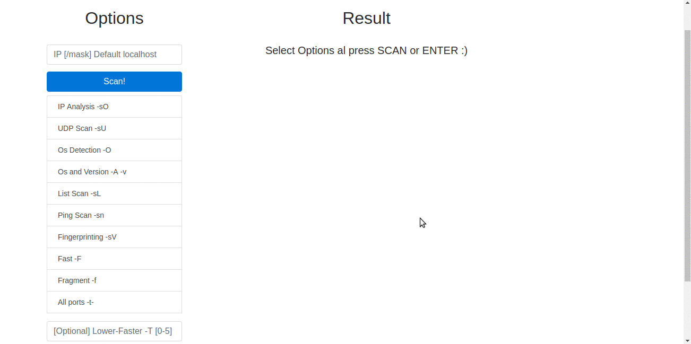

> :dizzy: Nmap web interface to execute the main commands more friendly.





## Install

```bash
  $ git clone git@github.com:ericsuarez/wmap.git
  $ cd wmap
  $ npm i 
  $ npm start
```


## Licence


MIT © [Eric. R. Suárez](https://ericsuarez.github.io/)

